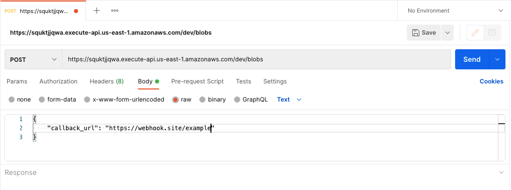
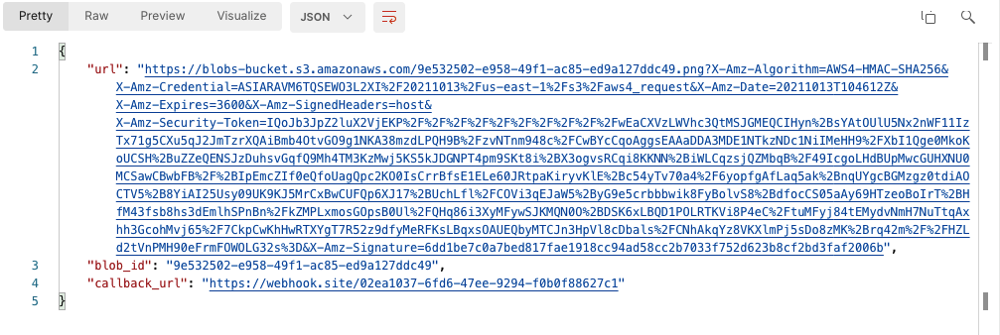
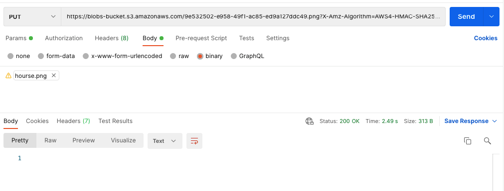
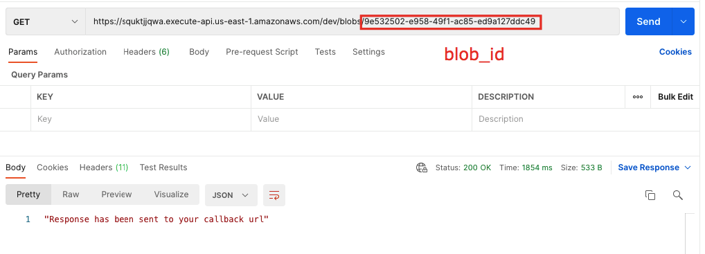
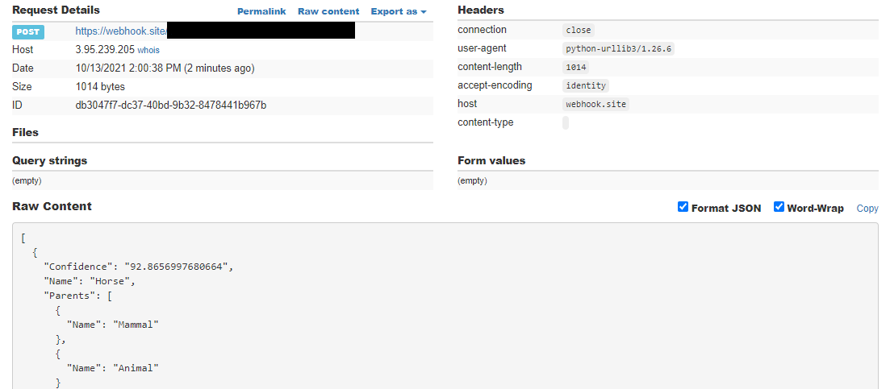

# AWS Rekognition API

## Description
The project is AWS Rekognition API which analyzes the photo you sent and returns the answer what things contains in the image. API have 2 endpoints POST (to send callback url) and GET (to get info about sent photo). And also after POST request you will get a presign url to send a file of photo using PUT request finally you will get answer which contain presign_url, your callback_url and blob_id what must be used in GET request. Expiration time of presign_url is 1 hour.

## Links
POST link: https://squktjjqwa.execute-api.us-east-1.amazonaws.com/dev/blobs

GET link: https://squktjjqwa.execute-api.us-east-1.amazonaws.com/dev/blobs/{blob_id}

## Getting Started

### Webhook url: Example
For example you can get callback_url with webhook.site <a href="https://webhook.site/">here</a> and copy your unique URL.

### POST request: Example
1. For first you should to send a callback_url via POST request using POST link.
 

### PUT request: Example
2. For second you should to send a photo via PUT request using presign_url got in first step.
 

### GET request: Example
3. For third you should add blob_id got in first step in the end of GET link and send GET request.
 

### Finally response: Example
4. Finally you should check response to your callback_url.
 

